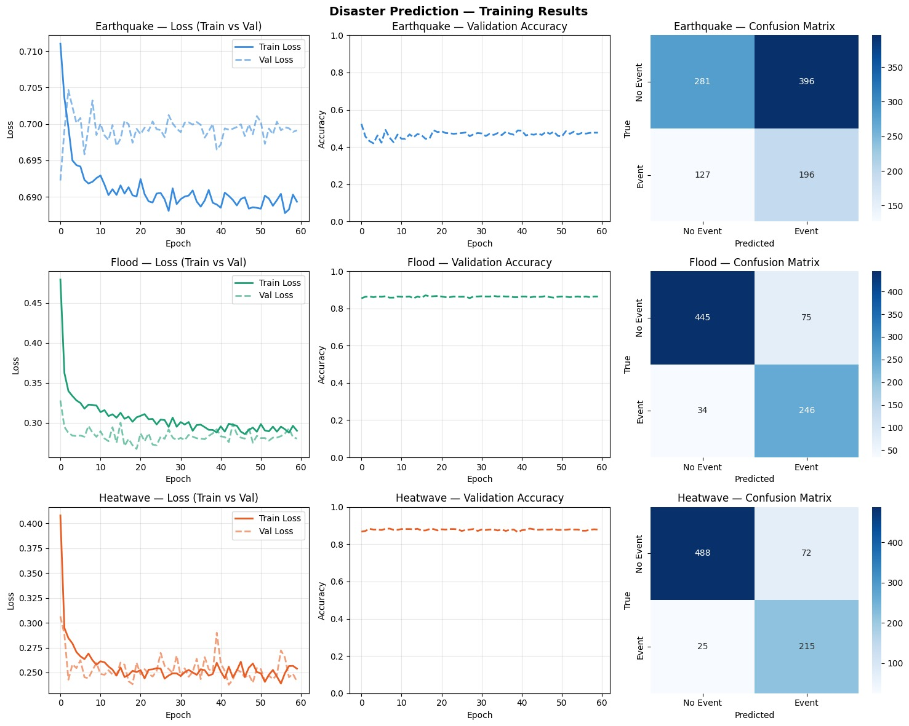

# 🌪️ DisasterSense  
### *Helping you stay safe — before, during, and after disasters.*

---

## 🧭 What is DisasterSense?

DisasterSense is a disaster preparedness app built with one simple goal:  
**to help people make the right decisions when everything feels uncertain.**

Instead of just sending alerts, it actually **guides you** —  
whether it’s *before a disaster hits*, *while it’s happening*, or *after things go wrong*.

---

## ❗ The Problem

When disasters happen, people often:
- Get alerts too late  
- Don’t know what action to take  
- Can’t find safe routes  
- Lose internet access  
- Panic  

In those moments, confusion can be dangerous.

---

## 💡 Our Approach

We focus on **3 key stages of disaster management**:

---

## 🔮 1. Before the Disaster — AI Prediction System

At the core of DisasterSense is our **AI-powered prediction system**.

We are working on **3 major disaster types**:
- 🌍 Earthquakes  
- 🌊 Floods  
- 🌡️ Heatwaves  

---

### 🧠 Deep Learning Models

We built and trained **3 separate deep learning models**:

- Earthquake Prediction Model  
- Flood Prediction Model  
- Heatwave Prediction Model  

These models analyze:
- Temperature  
- Wind speed  
- Environmental conditions  
- Historical patterns  

👉 The goal is simple:  
**Predict if a disaster is likely to happen before it actually occurs.**

---

### 📊 Model Performance

| Disaster     | Accuracy | AUC-ROC |
|-------------|---------|--------|
| Earthquake  | ~48%    | ~0.52  |
| Flood       | ~86%    | ~0.95  |
| Heatwave    | ~88%    | ~0.96  |

---

### 📷 Training & Evaluation

We monitored our models using:
- Training vs Validation Loss  
- Accuracy graphs  
- Confusion matrices  

These help us understand how well the model performs and where it can improve.

---

### 🚀 Why This Matters

Most apps react **after** disasters happen.  
We try to answer:

👉 **"What if we knew before?"**

That early signal can:
- Save time  
- Reduce panic  
- Save lives  

---

## 🗺️ 2. During the Disaster — Smart Safe Routing

Once a disaster occurs, the app switches into **real-time guidance mode**.

---

### 📍 What the System Provides

- 🔴 Danger zones (areas to avoid)  
- 🟢 Safe routes  
- 🏠 Shelter locations  
- 📦 Supply & relief stations  

👉 Routes dynamically adjust to avoid risky areas.

---

### 🧭 Safe Route Visualization

---

### ⚙️ Control Panel

Users can:
- Select starting location  
- Choose auto-shelter or custom destination  
- Simulate disaster scenarios  

  

---

### 📌 Route Guidance System

Step-by-step navigation instructions are provided:

---

### 🗺️ Map Legend

- 🟢 Green → Safe Route  
- 🔴 Red → Danger Zone  
- 🔵 Blue → Shelter  
- 🟠 Orange → Supply  

---

### 🚀 What Makes It Powerful

Instead of just telling users *“stay safe”*,  
👉 we show them **exactly where to go**.

---

## 🎙️ 3. After / Panic Situations — Voice + Offline Help

When users panic, reading is hard. Typing is harder.

---

### 🎤 Voice Assistant
- Talk to the app naturally  
- Get real-time instructions  
- Receive guidance instantly  

---

### 📡 Offline Emergency Guide
- Works without internet  
- Provides survival instructions  
- Gives situation-based help  

👉 Because disasters don’t depend on network signals.

---

## ⚙️ How It Works
